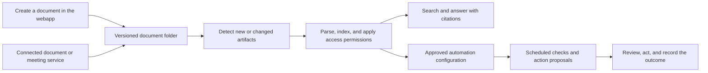

# Future workstream: document creation, meeting capture, and automation

Status: planning only. Branch: `plan/document-services`. This workstream extends the company knowledge assistant after the core demo is ready. No meeting bot, external service connection, or scheduled job is activated by this plan.

## Purpose and demo story

Help employees turn day-to-day work into shared, searchable knowledge. Users can create documents in the webapp or connect an external document or meeting service. New documents enter the same RAG processing pipeline as uploaded sources, and approved follow-up work can be linked to configured automations.

The future walkthrough uses a fictional product/support meeting. An assistant joins a meeting when invited by an authorized user, captures notes and a transcript, and produces a summary with decisions and action points. The artifacts appear in a connected folder. Automatic ingestion makes them searchable with source references. A scheduled review checks unresolved action points and prepares a follow-up for a reviewer.

## Intended flow

## Capabilities

### Create documents

- Provide a document workspace with templates for meeting notes, decision records, project updates, and process drafts.
- Generate a draft from user instructions and accessible company knowledge; preserve supporting source references when company facts are used.
- Let the author edit, version, and save the document to a chosen destination folder. Use draft/reviewed status so generated content is not silently treated as approved company policy.
- Save new versions through the same ingestion path as connected-service outputs.

### Connect document and meeting services

- Add a connections screen where a user chooses a provider, authorizes access, selects source folders or meetings, and sees connection and ingestion status.
- Support direct document creation plus adapters for external document generators, meeting assistants, and storage services. Select a real provider when this workstream moves into implementation.
- For the meeting flow, retain the transcript, notes, summary, decisions, and action points as distinct artifacts tied to the same meeting record. Preserve timestamps and original source links where available.
- Make recording and assistant attendance visible to participants, and use the meeting platform's permission/consent flow before capture.
- Give users control over folders, audience, retention, connection removal, and stopping further ingestion.

### Ingest automatically for RAG

- Use provider change events where available and a configurable scheduled sync as a fallback. Both paths call one ingestion interface.
- Track each artifact's source ID, version, owner, audience, meeting/document ID, creation/update time, origin link, and draft/reviewed status. Do not require a separate copy of the RAG engine for each provider.
- Import and index new or changed content, replace obsolete indexed versions, and handle deletion or permission changes so search does not keep exposing inaccessible source material.
- Deduplicate repeated events and sync results. Show processing state, failures, and a retry option in the knowledge library.
- Keep transcripts and summaries attributable to their original meeting. Treat recorded opinions, proposed actions, and AI summaries according to their source/status rather than presenting them as approved policy.

### Connect to scheduled automation

- Let a user attach an imported meeting or document to an existing automation, or configure a future recurring workflow with its cadence, owner, knowledge sources, destination, and approval rule.
- First support a small catalog of operations: review open action points, prepare a team digest, and flag decisions needing follow-up. Use shared adapter interfaces so additional services can be supported later.
- Distinguish explicit meeting decisions from suggested action points. Make a detected action point a proposal until its owner and intended outcome are confirmed.
- Require review for consequential external actions such as sending messages or modifying another system. Internal indexing and previously approved scheduled checks can run automatically within their configured scope.
- Record schedule runs, sources consulted, proposed/completed actions, approvals, and outcomes in the shared decision/activity log. Avoid duplicate actions when a job is retried; report meaningful failures or items requiring attention.
- Include pause/resume and connection health controls. Do not let instructions inside imported documents create schedules, change permissions, or authorize tool calls.

## Architecture and interfaces

Reuse the planned separation: `frontend/` for creation, connection, and automation controls; `backend/` for document records, integration events, permissions, approvals, and schedule configuration; `processing/` for parsing, indexing, and retrieval. Add provider adapters behind a common document-event and action interface when implemented.

The minimum shared contracts are a source artifact with provenance and access metadata; a new/change/delete event; an ingestion job with status and retry information; an action proposal with evidence, owner, and approval state; and an automation configuration with cadence and execution history. The initial prototype can use local files and simulated events while retaining these boundaries.

## Delivery stages

1. **Simulated walkthrough:** Generate a fictional transcript, summary, decision record, and action list; save them to a demo folder; simulate a change event, automatic ingestion, and a scheduled follow-up. No real meeting attendance or external messages.
2. **Document workspace:** Add template-based creation, grounded drafting, editing, saved versions, and automatic ingestion.
3. **First live connection:** Choose one meeting/document provider and one storage destination; implement permissions, sync, retries, updates, and deletion handling. Keep the rest behind adapter interfaces.
4. **Automation connection:** Add configuration and run history for the initial operation catalog, review/approval, and one selected external action destination.

The core RAG demo can be delivered before these stages. Choose providers and hosting based on the target company's tools when implementation begins; this planning branch does not commit to a specific vendor or activate services.

## Acceptance scenarios for later implementation

- A newly saved meeting transcript becomes searchable automatically, and an answer links back to the meeting and relevant timestamp or excerpt.
- An edited summary updates the indexed version; duplicate events do not create duplicate documents or follow-up tasks.
- A generated process draft is searchable with draft status, and conflicting approved policy remains visible to the user.
- A user without permission cannot retrieve protected meeting content; revoked or deleted source material is removed from future answers.
- A failed connection or processing job shows a useful state and can resume without losing the original source.
- A scheduled check uses its configured sources and cadence, prepares action proposals, and records its evidence and outcome.
- A consequential external action waits for the configured reviewer; retrying an approved run does not execute it twice.
- Imported text that asks the system to create a schedule or bypass review is treated as document content, not authorization.
